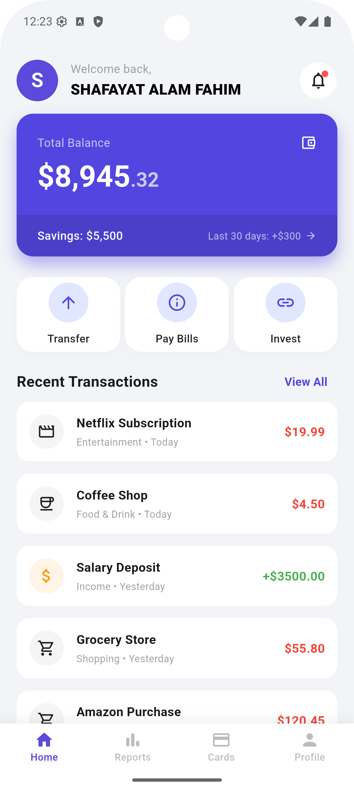
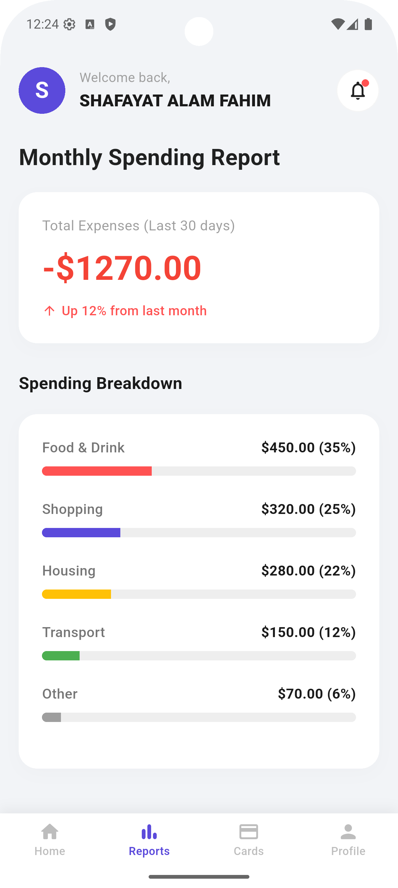
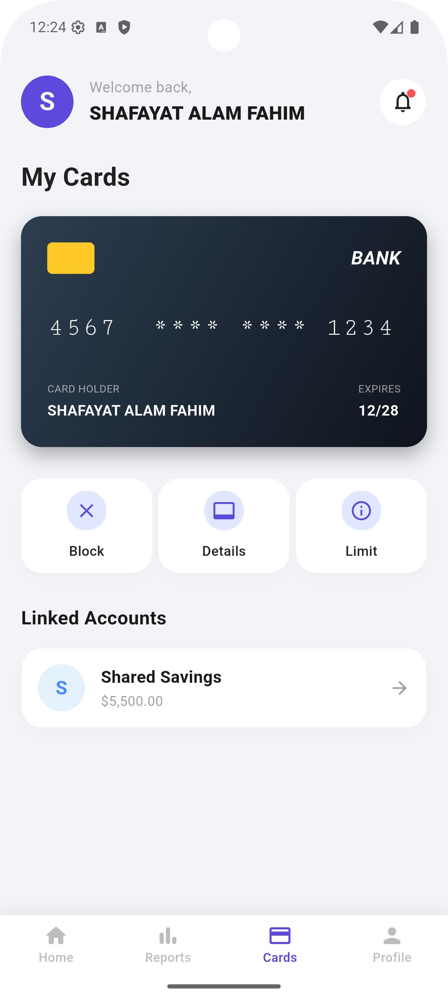
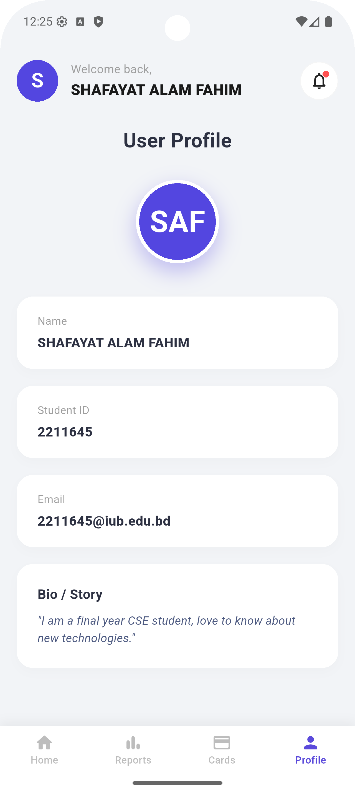

# Assignment on Flutter UI

This is a simple Finance App UI created using Flutter. It features a custom design with four pages: **Home**, **Reports**, **Cards**, and **Profile**.

## Screenshots

| **Page 1: Home** | **Page 2: Reports** |
|:---:|:---:|
|  |  |
| **Page 3: Cards** | **Page 4: Profile** |
|  |  |
